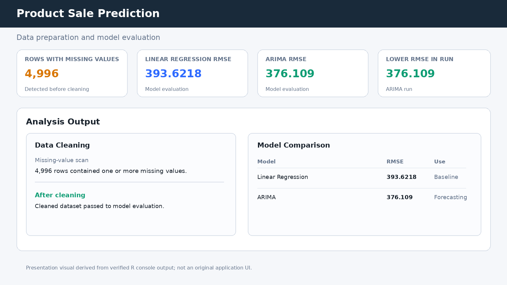
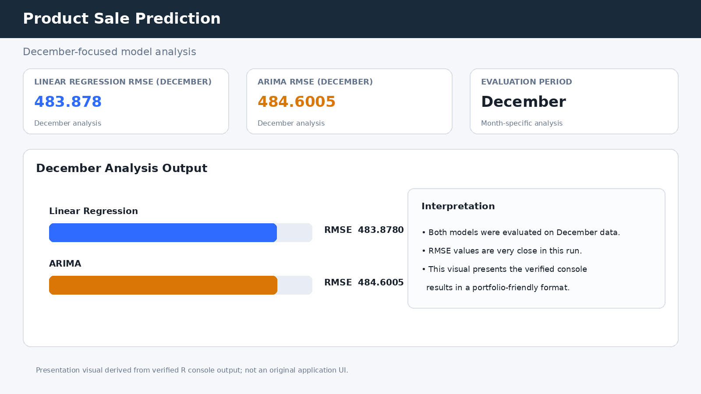

# Product Sale Prediction & Forecasting in R

R-based retail sales analysis and forecasting using **Linear Regression** and **ARIMA**. The project cleans transaction-level data, aggregates sales by day, compares predictive approaches with RMSE, and performs a focused December analysis.

## Highlights

- Missing-value inspection and cleaning
- Duplicate removal and data-type normalization
- Outlier filtering for `Total Spent`
- Daily sales aggregation
- 80/20 train-test split
- Linear Regression baseline
- ARIMA time-series forecasting with a weekly frequency assumption
- RMSE-based model comparison
- December-only analysis
- Actual-vs-predicted visualizations

## Workflow

```text
Retail transaction data
        ↓
Missing-value analysis
        ↓
Cleaning + duplicate removal
        ↓
Type normalization + outlier filtering
        ↓
Daily sales aggregation
        ↓
80/20 train-test split
        ↓
Linear Regression + ARIMA
        ↓
RMSE comparison
        ↓
December-specific analysis
```

## Repository Structure

```text
product-sale-prediction-r/
├── data/
│   ├── retail_store_sales.csv
│   └── README.md
├── scripts/
│   ├── sales_prediction.R
│   ├── in_december.R
│   └── install_packages.R
├── screenshots/
│   ├── 01-model-evaluation-ui.png
│   └── 02-december-analysis-ui.png
├── run_analysis.R
├── .gitignore
└── README.md
```

## Requirements

- R 4.x recommended
- Packages: `readr`, `dplyr`, `ggplot2`, `forecast`, `Metrics`

Install the packages with:

```r
source("scripts/install_packages.R")
```

## Run

From the repository root:

```r
source("run_analysis.R")
```

The runner executes the main analysis and then the December-specific analysis in the same R session. The scripts print evaluation metrics to the console and create the analysis plots in the active R graphics device.

You can also execute the scripts separately:

```r
source("scripts/sales_prediction.R")
source("scripts/in_december.R")
```

## Model Evaluation

The original project run produced these console results:

| Evaluation | Linear Regression RMSE | ARIMA RMSE |
|---|---:|---:|
| Overall test split | 393.6218 | 376.1090 |
| December test split | 483.8780 | 484.6005 |

These values are included as **recorded results from the project run**; rerunning the analysis can produce different values if the data or environment changes.

## Visual Showcase

### Model Evaluation



### December Analysis



> The two images above are **presentation visuals** created from the project's verified console results and analysis workflow. They are included to make the repository easier to understand visually; they are not a claim that the original project contained a graphical user interface.

## Technical Notes

- The primary analysis uses daily aggregated `Total Spent` as the sales target.
- Linear Regression uses day-of-year and year as input variables.
- ARIMA models the training sales series with `frequency = 7`, representing a weekly seasonal assumption.
- The December script filters transactions to month 12 before repeating the train/test and model-evaluation workflow.

## Project Type

**Data Science / Predictive Analytics / Time-Series Forecasting**

## License

No open-source license is included at this time. Reuse and redistribution should not be assumed without permission.
